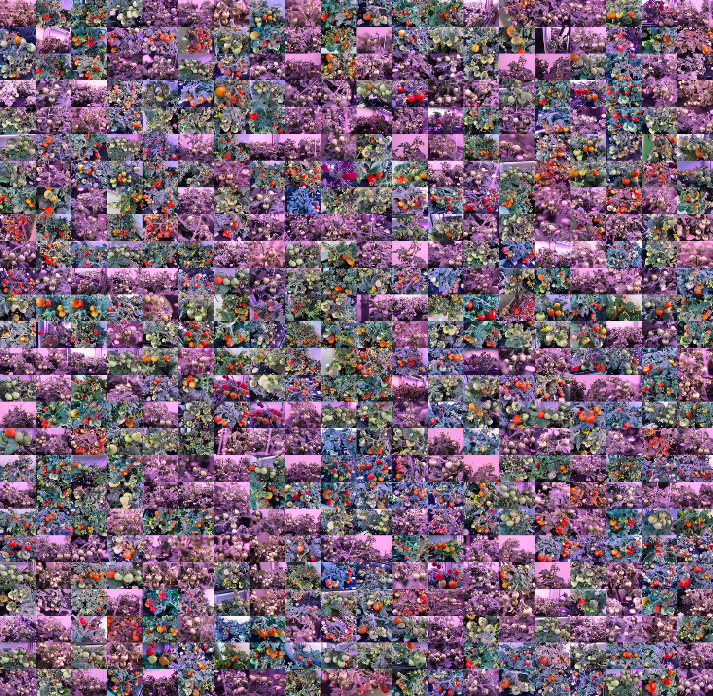

# TomatoPlantfactoryDataset

[](https://doi.org/10.1016/j.dib.2023.109291)
[](https://doi.org/10.17632/8h3s6jkyff.2)
[](https://creativecommons.org/licenses/by/4.0/)

A GitHub entry point for **TomatoPlantfactoryDataset**, a tomato fruit
object-detection dataset collected in an artificial-light plant factory.

Data files are hosted on Mendeley Data:

- Dataset archive: <https://data.mendeley.com/datasets/8h3s6jkyff/2>
- Dataset DOI: <https://doi.org/10.17632/8h3s6jkyff.2>
- Data article: <https://doi.org/10.1016/j.dib.2023.109291>

## Dataset At A Glance

| Item | Description |
| --- | --- |
| Task | Tomato fruit object detection |
| Scene | Artificial-light plant factory, complex lighting, occlusion, blur, distance and viewpoint changes |
| Crop | Micro tomato |
| Images | 520 JPG images |
| Resolutions | 6000 x 4000 and 4032 x 3024 |
| Classes | `green`, `red` |
| Published instance counts | 5996 green fruits, 3116 red fruits, 9112 total fruit instances |
| Annotation formats | Pascal VOC XML and YOLO TXT |
| Original archive size | About 3 GB |
| License | CC BY 4.0 |

Annotation note: the published 9112-instance count comes from the Pascal VOC
XML files. The distributed YOLO labels contain 8223 rows; the difference matches
889 green-fruit objects marked as `difficult` in XML.

## Sample Images



The preview is a 20x26 mosaic of all 520 images, downsampled for GitHub.

Regenerate it after extracting the dataset locally:

```bash
pip install pillow
python make_sample_gallery.py --root TomatoPlantfactoryDataset --out assets/sample-gallery-dense.jpg --cols 20 --rows 26
```

## Repository Contents

| File | Purpose |
| --- | --- |
| `README.md` | GitHub landing page |
| `DATASET_CARD.md` | Dataset description, uses and limits |
| `QUICKSTART_YOLO.md` | YOLO training workflow |
| `CITATIONS.md` | Citation formats and related papers |
| `BENCHMARKS.md` | Benchmark table template and reporting rules |
| `CITATION.cff` | GitHub citation metadata |
| `verify_dataset.py` | Dataset check and annotation summary |
| `prepare_yolo_split.py` | Ultralytics-style train/val/test split |
| `make_sample_gallery.py` | Dense README sample-mosaic generator |
| `tomato-plant-factory.yaml` | Example Ultralytics data config |
| `assets/` | Downsampled preview images |

## Download And Verify

Download the official archive and extract it into the ignored local data folder:

```bash
mkdir -p TomatoPlantfactoryDataset
unzip TomatoPlantfactoryDataset.zip -d TomatoPlantfactoryDataset
python verify_dataset.py --root TomatoPlantfactoryDataset
```

Expected local layout after extraction:

```text
TomatoPlantfactoryDataset/
  Images/
  Annotations/
  labels/
```

The data folder, PDF article, archives, weights and training outputs are ignored
by Git.

## Quick YOLO Start

Create an Ultralytics-compatible split:

```bash
python prepare_yolo_split.py --root TomatoPlantfactoryDataset --out yolo_dataset --train 0.8 --val 0.1 --seed 42
```

Train a small YOLO detector:

```bash
pip install ultralytics
yolo detect train model=yolov8n.pt data=yolo_dataset/data.yaml imgsz=640 epochs=100
```

See [QUICKSTART_YOLO.md](QUICKSTART_YOLO.md) for the full workflow.

## Why This Dataset Is Useful

- It targets plant-factory tomato detection, where artificial lighting and growth
  stages create strong color and illumination shifts.
- It contains high-resolution images, which are useful for small-fruit detection
  and high-detail visual inspection.
- It includes both Pascal VOC and YOLO annotations, making it easy to use with
  common object-detection pipelines.
- It can support detection, maturity classification, counting, yield estimation,
  harvesting-robot perception and transfer-learning experiments.

## Papers Using Or Citing This Dataset

Selected papers that use or cite TomatoPlantfactoryDataset:

1. Abdu, F. J. and Khan, A. H. (2026). [TomatoGrow-3: A Composite Dataset and Benchmark for Tomato Growth-Stage Classification using Transfer Learning and Fine-Tuning](https://doi.org/10.1109/ICCE67443.2026.11449681). In *2026 IEEE International Conference on Consumer Electronics (ICCE)*, 1-6.
2. Guo, J., Liu, Z., Zhang, X., Wang, R., Ma, X. and Li, W. (2026). [SlimTom-DETR: A Lightweight and Real-Time Tomato Detection Model for Plant Factories With Complex Lighting Conditions](https://doi.org/10.1109/ACCESS.2026.3672401). *IEEE Access*, 14, 41782-41801.
3. Liao, B., Wang, Y., Li, X., Cheng, Y., Zhao, G. and Zhou, Y. (2026). [Deep Learning-Based Image Recognition for Food Science and Technology: End-to-End Workflows and Domain-Specific Solutions](https://doi.org/10.1111/1541-4337.70388). *Comprehensive Reviews in Food Science and Food Safety*, 25(1), e70388.
4. Carbone, G., Gurtatta, A. S. and Malyshev, D. (2025). [Development and implementation of a hybrid visual prediction algorithm for robotic smart tomato harvesting](https://doi.org/10.1016/j.engappai.2025.112261). *Engineering Applications of Artificial Intelligence*, 161, 112261.
5. Mohammed, A., Ibrahim, H. M. and Omar, N. M. (2025). [Optimizing RetinaNet anchors using differential evolution for improved object detection](https://doi.org/10.1038/s41598-025-02888-x). *Scientific Reports*, 15, 20101.
6. Liu, W., Liu, Q., Quan, W., Wang, J., Yao, X., Liu, Q. and Tian, Y. (2025). [LiteTom-RTDETR: A Lightweight Real-Time Tomato Detection System for Plant Factories](https://doi.org/10.3390/app15126589). *Applied Sciences*, 15(12), 6589.
7. Jin, Y., Xia, X., Gao, Q., Yue, Y., Lim, E. G., Wong, P., Ding, W. and Zhu, X. (2025). [Deep learning in produce perception of harvesting robots: A comprehensive review](https://doi.org/10.1016/j.asoc.2025.112971). *Applied Soft Computing*, 174, 112971.
8. Malyshev, D., Gurtatta, A. S. and Carbone, G. (2025). [Development of an Object Detection Algorithm Based on Trained Models Integration: A Tomato Detection Case](https://doi.org/10.1007/978-3-031-91179-8_15). In *Proceedings of I4SDG Workshop 2025 - IFToMM for Sustainable Development Goals*, 137-146.
9. Nguyen, D.-L., Vo, X.-T., Priadana, A., Choi, J. and Jo, K.-H. (2025). [An Efficient Detector for Automatic Tomato Classification Systems](https://doi.org/10.1109/ACCESS.2024.3522349). *IEEE Access*, 13, 14073-14082.
10. Chakraborty, S. S. and Thakurta, P. K. G. (2025). [Classification of Tomato Maturity Levels: An Efficient Approach with Statistical Features](https://doi.org/10.1007/978-3-031-81342-9_7). In *Computational Intelligence in Communications and Business Analytics*, 70-83.
11. Zhou, C., Zhang, Y., Fu, W., Yao, L. and Yin, C. (2025). [MDE-DETR: multi-domain enhanced feature fusion algorithm for bayberry detection and counting in complex orchards](https://doi.org/10.3389/fpls.2025.1711545). *Frontiers in Plant Science*, 16, 1711545.
12. Lim, H., Kim, Y., Kim, S. and Kim, S. (2025). [Convolutional Neural Network (CNN)-based transfer learning framework for cherry tomato production](https://doi.org/10.25165/j.ijabe.20251805.9827). *International Journal of Agricultural and Biological Engineering*, 18(5), 90-101.
13. Casilla, J. J. F., Tica, M. F. M. and Torres, R. R. S. (2024). [Automation in Agriculture: Design and Evaluation of an Intelligent Robot for Maize Planting with Automatic Irrigation](https://doi.org/10.14445/23488379/IJEEE-V11I10P122). *International Journal of Electrical and Electronics Engineering*, 11(10), 216-222.
14. Himeur, M. and Hassam, A. (2024). [Tomato Fruit Detection and Tracking in Real-Time Using YOLOv8](https://doi.org/10.1109/AFROS62115.2024.11036891). In *2024 International Conference of the African Federation of Operational Research Societies (AFROS)*, 1-4.
15. Hito, G. A. R., Bravo, Y. A. P., Pampa, R. A. V., Talavera, S. J. and Guevara, M. J. (2023). [Development and Control of Drones Applied to Monitoring in Fruit Growing during the Harvesting](https://doi.org/10.14445/23488379/IJEEE-V10I12P110). *International Journal of Electrical and Electronics Engineering*, 10(12), 95-101.

## Citation

If you use this dataset, please cite the published data article:

```bibtex
@article{Wu2023TomatoPlantfactoryDataset,
  title = {A dataset of tomato fruits images for object detection in the complex lighting environment of plant factories},
  author = {Wu, Zhen-wei and Liu, Ming-hao and Sun, Cheng-xiu and Wang, Xin-fa},
  journal = {Data in Brief},
  volume = {48},
  pages = {109291},
  year = {2023},
  doi = {10.1016/j.dib.2023.109291},
  url = {https://doi.org/10.1016/j.dib.2023.109291}
}
```


## License

The dataset is distributed under
[Creative Commons Attribution 4.0 International](https://creativecommons.org/licenses/by/4.0/).
Use the official Mendeley Data page as the license record.

## Chinese Note

这个仓库用于展示 TomatoPlantfactoryDataset，并提供下载入口、引用格式、样张、
YOLO 快速开始和相关论文列表。数据本体以 Mendeley Data 为准。
